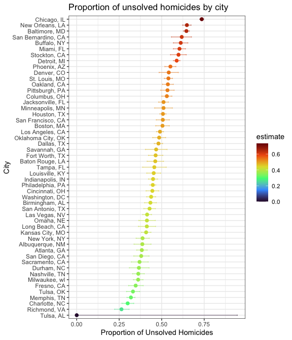
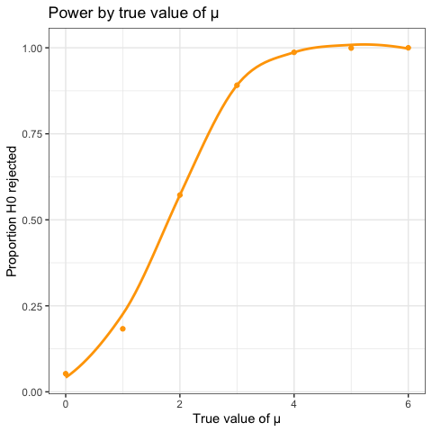
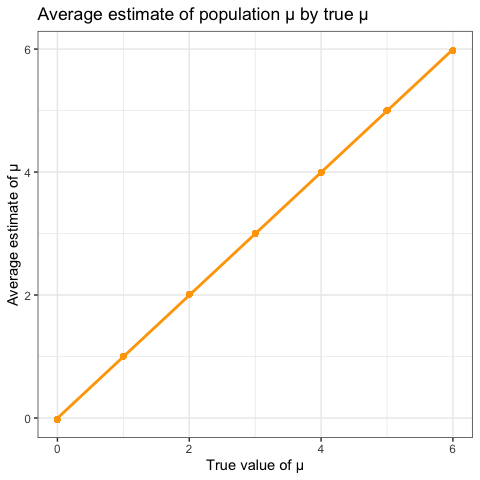
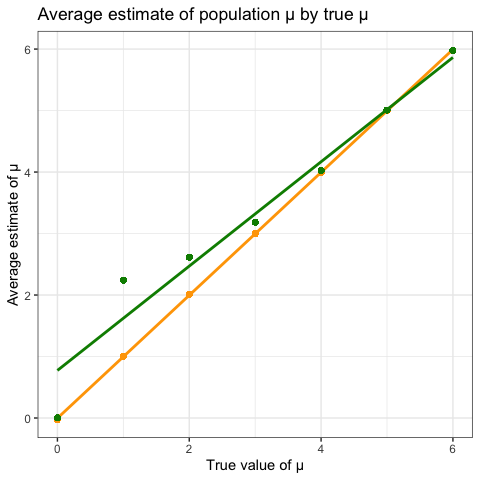

p8105_hw5_csf2135
================
2023-11-15

### Problem 1

**The Washington Post has gathered data on homicides in 50 large U.S.
cities and made the data available through a GitHub repository here. You
can read their accompanying article here.**

``` r
url = "https://raw.githubusercontent.com/washingtonpost/data-homicides/master/homicide-data.csv"

df_homicides = read_csv(url(url))

df_homicides |> head()

skimr::skim(df_homicides)
```

**Describe the raw data.**

The raw data includes variables for the victim’s first and last name,
demographic information (sex, race, age). Each homicide has a unique
identifier (`uid`) and the date the incident was reported, the incident
location (city, state, latitude, longitude), and case status
(`disposition`) are provided.

There are 52179 observations in the data and 12 variables in the raw
data set. Most data is non-missing, except for 60 instances where
latitude/longitude data is missing. There are 52179 unique incidents
described in the data occurring in 50 unique cities across the US.

**Create a city_state variable (e.g. “Baltimore, MD”) and then summarize
within cities to obtain the total number of homicides and the number of
unsolved homicides (those for which the disposition is “Closed without
arrest” or “Open/No arrest”).**

``` r
df_homicides <- df_homicides |> 
  mutate(city_state = paste(city, state, sep = ", "))

df_city_state_unsolved <- df_homicides |> 
  group_by(city_state) |> 
  summarise(
    total_homicides = n(),
    unsolved_homicides = sum(disposition %in% c("Closed without arrest", "Open/No arrest"))
  ) |> 
  select(city_state, total_homicides, unsolved_homicides) |> 
  unique()

knitr::kable(df_city_state_unsolved, format = "markdown")
```

| city_state         | total_homicides | unsolved_homicides |
|:-------------------|----------------:|-------------------:|
| Albuquerque, NM    |             378 |                146 |
| Atlanta, GA        |             973 |                373 |
| Baltimore, MD      |            2827 |               1825 |
| Baton Rouge, LA    |             424 |                196 |
| Birmingham, AL     |             800 |                347 |
| Boston, MA         |             614 |                310 |
| Buffalo, NY        |             521 |                319 |
| Charlotte, NC      |             687 |                206 |
| Chicago, IL        |            5535 |               4073 |
| Cincinnati, OH     |             694 |                309 |
| Columbus, OH       |            1084 |                575 |
| Dallas, TX         |            1567 |                754 |
| Denver, CO         |             312 |                169 |
| Detroit, MI        |            2519 |               1482 |
| Durham, NC         |             276 |                101 |
| Fort Worth, TX     |             549 |                255 |
| Fresno, CA         |             487 |                169 |
| Houston, TX        |            2942 |               1493 |
| Indianapolis, IN   |            1322 |                594 |
| Jacksonville, FL   |            1168 |                597 |
| Kansas City, MO    |            1190 |                486 |
| Las Vegas, NV      |            1381 |                572 |
| Long Beach, CA     |             378 |                156 |
| Los Angeles, CA    |            2257 |               1106 |
| Louisville, KY     |             576 |                261 |
| Memphis, TN        |            1514 |                483 |
| Miami, FL          |             744 |                450 |
| Milwaukee, wI      |            1115 |                403 |
| Minneapolis, MN    |             366 |                187 |
| Nashville, TN      |             767 |                278 |
| New Orleans, LA    |            1434 |                930 |
| New York, NY       |             627 |                243 |
| Oakland, CA        |             947 |                508 |
| Oklahoma City, OK  |             672 |                326 |
| Omaha, NE          |             409 |                169 |
| Philadelphia, PA   |            3037 |               1360 |
| Phoenix, AZ        |             914 |                504 |
| Pittsburgh, PA     |             631 |                337 |
| Richmond, VA       |             429 |                113 |
| Sacramento, CA     |             376 |                139 |
| San Antonio, TX    |             833 |                357 |
| San Bernardino, CA |             275 |                170 |
| San Diego, CA      |             461 |                175 |
| San Francisco, CA  |             663 |                336 |
| Savannah, GA       |             246 |                115 |
| St. Louis, MO      |            1677 |                905 |
| Stockton, CA       |             444 |                266 |
| Tampa, FL          |             208 |                 95 |
| Tulsa, AL          |               1 |                  0 |
| Tulsa, OK          |             583 |                193 |
| Washington, DC     |            1345 |                589 |

**For the city of Baltimore, MD, use the prop.test function to estimate
the proportion of homicides that are unsolved; save the output of
prop.test as an R object, apply the broom::tidy to this object and pull
the estimated proportion and confidence intervals from the resulting
tidy dataframe.**

``` r
prop_unsolved = function(x) {
  
  if (is.na(x)) {
    stop("missing city name")
  } 
  
    state_unsolved_homicides <- df_city_state_unsolved  |> 
                                filter(city_state == x)  |> 
                                pull(unsolved_homicides)

    state_total_homicides <- df_city_state_unsolved  |> 
                                filter(city_state == x)  |> 
                                pull(total_homicides)
                                

    state_homicide_prop <- prop.test(state_unsolved_homicides, state_total_homicides) |> 
       broom::tidy() |>
       mutate(city_state = paste(x)) |> 
       select(city_state, estimate, `conf.high`, `conf.low`)
       
    
    return(state_homicide_prop)
}

prop_unsolved("Baltimore, MD") |> 
  knitr::kable(format = "markdown", digits = 2)
```

| city_state    | estimate | conf.high | conf.low |
|:--------------|---------:|----------:|---------:|
| Baltimore, MD |     0.65 |      0.66 |     0.63 |

**Now run prop.test for each of the cities in your dataset, and extract
both the proportion of unsolved homicides and the confidence interval
for each. Do this within a “tidy” pipeline, making use of purrr::map,
purrr::map2, list columns and unnest as necessary to create a tidy
dataframe with estimated proportions and CIs for each city.**

``` r
cities <- as.vector(df_city_state_unsolved |> pull(city_state) |> unique())

df_prop_unsolved <- map_dfr(cities, prop_unsolved) 

knitr::kable(df_prop_unsolved, digits = 2)
```

| city_state         | estimate | conf.high | conf.low |
|:-------------------|---------:|----------:|---------:|
| Albuquerque, NM    |     0.39 |      0.44 |     0.34 |
| Atlanta, GA        |     0.38 |      0.41 |     0.35 |
| Baltimore, MD      |     0.65 |      0.66 |     0.63 |
| Baton Rouge, LA    |     0.46 |      0.51 |     0.41 |
| Birmingham, AL     |     0.43 |      0.47 |     0.40 |
| Boston, MA         |     0.50 |      0.55 |     0.46 |
| Buffalo, NY        |     0.61 |      0.65 |     0.57 |
| Charlotte, NC      |     0.30 |      0.34 |     0.27 |
| Chicago, IL        |     0.74 |      0.75 |     0.72 |
| Cincinnati, OH     |     0.45 |      0.48 |     0.41 |
| Columbus, OH       |     0.53 |      0.56 |     0.50 |
| Dallas, TX         |     0.48 |      0.51 |     0.46 |
| Denver, CO         |     0.54 |      0.60 |     0.48 |
| Detroit, MI        |     0.59 |      0.61 |     0.57 |
| Durham, NC         |     0.37 |      0.43 |     0.31 |
| Fort Worth, TX     |     0.46 |      0.51 |     0.42 |
| Fresno, CA         |     0.35 |      0.39 |     0.31 |
| Houston, TX        |     0.51 |      0.53 |     0.49 |
| Indianapolis, IN   |     0.45 |      0.48 |     0.42 |
| Jacksonville, FL   |     0.51 |      0.54 |     0.48 |
| Kansas City, MO    |     0.41 |      0.44 |     0.38 |
| Las Vegas, NV      |     0.41 |      0.44 |     0.39 |
| Long Beach, CA     |     0.41 |      0.46 |     0.36 |
| Los Angeles, CA    |     0.49 |      0.51 |     0.47 |
| Louisville, KY     |     0.45 |      0.49 |     0.41 |
| Memphis, TN        |     0.32 |      0.34 |     0.30 |
| Miami, FL          |     0.60 |      0.64 |     0.57 |
| Milwaukee, wI      |     0.36 |      0.39 |     0.33 |
| Minneapolis, MN    |     0.51 |      0.56 |     0.46 |
| Nashville, TN      |     0.36 |      0.40 |     0.33 |
| New Orleans, LA    |     0.65 |      0.67 |     0.62 |
| New York, NY       |     0.39 |      0.43 |     0.35 |
| Oakland, CA        |     0.54 |      0.57 |     0.50 |
| Oklahoma City, OK  |     0.49 |      0.52 |     0.45 |
| Omaha, NE          |     0.41 |      0.46 |     0.37 |
| Philadelphia, PA   |     0.45 |      0.47 |     0.43 |
| Phoenix, AZ        |     0.55 |      0.58 |     0.52 |
| Pittsburgh, PA     |     0.53 |      0.57 |     0.49 |
| Richmond, VA       |     0.26 |      0.31 |     0.22 |
| Sacramento, CA     |     0.37 |      0.42 |     0.32 |
| San Antonio, TX    |     0.43 |      0.46 |     0.39 |
| San Bernardino, CA |     0.62 |      0.68 |     0.56 |
| San Diego, CA      |     0.38 |      0.43 |     0.34 |
| San Francisco, CA  |     0.51 |      0.55 |     0.47 |
| Savannah, GA       |     0.47 |      0.53 |     0.40 |
| St. Louis, MO      |     0.54 |      0.56 |     0.52 |
| Stockton, CA       |     0.60 |      0.64 |     0.55 |
| Tampa, FL          |     0.46 |      0.53 |     0.39 |
| Tulsa, AL          |     0.00 |      0.95 |     0.00 |
| Tulsa, OK          |     0.33 |      0.37 |     0.29 |
| Washington, DC     |     0.44 |      0.46 |     0.41 |

**Create a plot that shows the estimates and CIs for each city – check
out geom_errorbar for a way to add error bars based on the upper and
lower limits. Organize cities according to the proportion of unsolved
homicides.**

``` r
plot_unsolved<- df_prop_unsolved  |> 
  arrange(estimate) |> 
  ggplot(aes(x = reorder(city_state, estimate), y = estimate, color = estimate)) +
    geom_point(size = 2) +
    scale_color_viridis_c(option = "turbo") +
    geom_errorbar(aes(ymin = conf.low, ymax = conf.high), width = 0.2, alpha = 0.5) +
    labs(title = "Proportion of unsolved homicides by city", x = "City", y = "Proportion of Unsolved Homicides") +
    coord_flip() + 
    theme(
      panel.background = element_rect(fill = "grey95"), 
      axis.title = element_text(color = "black", size = 14), 
      axis.text = element_text(color = "black", size = 11), 
      title = element_text(color = "black", size = 18)
    ) 

plot_unsolved
```



``` r
plot_save_path <- "hw5_plots/prop_unsolved_by_state.png"

ggsave(plot_save_path, plot_unsolved, device = "png", width = 8, height = 9, units = "in", dpi = 300)
```

### Problem 2

**This zip file contains data from a longitudinal study that included a
control arm and an experimental arm. Data for each participant is
included in a separate file, and file names include the subject ID and
arm.**

**Create a tidy dataframe containing data from all participants,
including the subject ID, arm, and observations over time:**

``` r
path_p2_data <- "problem2_data"

p2_csv_files <- list.files(path_p2_data, pattern = "\\.csv$", full.names = TRUE)

p2_data_frames <- map(p2_csv_files, ~ read_csv(.x) |> 
  mutate(
      subject_id = as.numeric(str_extract(.x, "(?<=_)\\d+(?=\\.csv$)")),
      arm = str_extract(.x, "([^/]+)_\\d+\\.csv$") |> str_remove("_\\d+\\.csv$")
  ))

df_p2_all <- bind_rows(p2_data_frames) |> 
  janitor::clean_names() |> 
  pivot_longer(
    cols = starts_with("week_"), 
    names_to = "week", 
    values_to = "estimate", 
    values_drop_na = TRUE
  ) |> 
  mutate(week = as.numeric(str_extract(week, "\\d+")))
```

**Make a spaghetti plot showing observations on each subject over time,
and comment on differences between groups.**

``` r
plot_trial<- df_p2_all  |> 
  mutate(
    subject_arm_group = paste(subject_id, arm, sep = "_")) |> 
  ggplot(aes(x = week, y = estimate, group = subject_arm_group, color = arm)) +
  geom_line(aes(color = arm)) +
  scale_color_brewer(palette = "Dark2") + 
  labs(title = "Trial estimates overtime, by arm", x = "Study week", y = "Estimate") +
    theme(
      panel.background = element_rect(fill = "grey95"), 
      axis.title = element_text(color = "black", size = 14), 
      axis.text = element_text(color = "black", size = 11), 
      title = element_text(color = "black", size = 18), 
      legend.text = element_text(color = "black", size = 11))

plot_trial
```


``` r
plot_save_path2 <- "hw5_plots/trial_weekly_estimates.png"

ggsave(plot_save_path2, plot_trial, device = "png", width = 8, height = 6, units = "in", dpi = 300)
```

Over the length of the study period, the experimental group (red)
consistently has higher estimates after week 2 compared to the control
group. The experimental group demostrates a positive trend overtime
while the control group shows a fairly flat, unchanging trendline from
week 1 to week 8.

### Problem 3

**When designing an experiment or analysis, a common question is whether
it is likely that a true effect will be detected – put differently,
whether a false null hypothesis will be rejected. In this problem, you
will conduct a simulation to explore power in a one-sample t-test.**

``` r
n <- 30
sigma <- 5
mu <- 0
  
num_datasets <- as.vector(1:5000)

  
generate_datasets <- function(x) {
  dataset <- rnorm(n, mean = mu, sd = sigma)
  
  t_test_result <- t.test(dataset, mu = mu, conf.level = 0.95) |> 
    broom::tidy() |> 
    mutate(iteration = paste(x)) |> 
    select(iteration, estimate, `p.value`)

  return(t_test_result)
}

df_mu_zero_norm <- map_dfr(num_datasets, generate_datasets) 
```

**Repeat the above for μ={1,2,3,4,5,6}, and complete the following:**

``` r
mu_list <- as.vector(0:6)

generate_datasets <- function(n, mu, sigma, x) {
  dataset <- rnorm(n, mean = mu, sd = sigma)
  
  t_test_result <- t.test(dataset, mu = 0) %>%
    broom::tidy() %>%
    mutate(iteration = x) %>%
    select(iteration, estimate, `p.value`)

  return(t_test_result)
}

dist_diff_mu <- function(mu) {
  n <- 30
  sigma <- 5
  num_datasets <- as.vector(1:5000)

  results <- map_dfr(num_datasets, ~generate_datasets(n, mu, sigma, .x)) %>%
    mutate(mu_test = paste(mu))

  return(results)
}

df_changing_mu_norm <- map_dfr(mu_list, dist_diff_mu)
```

**Make a plot showing the proportion of times the null was rejected (the
power of the test) on the y axis and the true value of μ on the x axis.
Describe the association between effect size and power.**

``` r
perc_reject <- df_changing_mu_norm |> 
  group_by(mu_test) |> 
  filter(`p.value` < 0.05) |> 
  summarise(total_tests = n()) |> 
  mutate(perc_reject = total_tests / 5000) |> 
  arrange(mu_test) |> 
  ungroup() |> 
  ggplot(aes(x= as.numeric(mu_test), y= perc_reject)) +
    geom_point(color = "orange") +
    geom_smooth(se=FALSE, color= "orange1") +
    labs(title = "Power by true value of μ", x = "True value of μ", y = "Proportion H0 rejected") +
      theme(
        panel.background = element_rect(fill = "grey95"), 
        axis.title = element_text(color = "black", size = 14), 
        axis.text = element_text(color = "black", size = 11), 
        title = element_text(color = "black", size = 18), 
        legend.text = element_text(color = "black", size = 11))
  
perc_reject
```



``` r
plot_save_path3 <- "hw5_plots/perc_null_reject.png"

ggsave(plot_save_path3, perc_reject, device = "png", width = 8, height = 6, units = "in", dpi = 300)
```

Looking at the proportion of times the null was rejected (power) by
ascending true effect estimates, we can see that the larger the effect
size the more power the analysis of the association with have. When
effect size is larger, the risk of rejecting the null when the null is
true decreases.

**Make a plot showing the average estimate of μ̂ on the y axis and the
true value of μ on the x axis.**

``` r
estimate_true <- df_changing_mu_norm |> 
  group_by(mu_test) |> 
  mutate(average_estimate = mean(estimate)) |> 
  arrange(mu_test) |> 
  ungroup() |>
  ggplot(aes(x= as.numeric(mu_test), y= average_estimate)) +
    geom_point(color = "orange") +
    geom_smooth(method = "lm", se=FALSE, color= "orange1") +
    labs(title = "Average estimate of population μ by true μ ", x = "True value of μ", y = "Average estimate of μ") +
      theme(
        panel.background = element_rect(fill = "grey95"), 
        axis.title = element_text(color = "black", size = 14), 
        axis.text = element_text(color = "black", size = 11), 
        title = element_text(color = "black", size = 18), 
        legend.text = element_text(color = "black", size = 11))
  
estimate_true
```



``` r
plot_save_path4 <- "hw5_plots/estimated_true_corr.png"

ggsave(plot_save_path4, estimate_true, device = "png", width = 8, height = 6, units = "in", dpi = 300)
```

Given the large sample size, the average estimate of the effect size is
well correlated to the true value of the effect size (orange).

**Make a second plot (or overlay on the first) the average estimate of μ̂
only in samples for which the null was rejected on the y axis and the
true value of μ on the x axis. Is the sample average of μ̂ across tests
for which the null is rejected approximately equal to the true value of
μ? Why or why not?**

``` r
df_estimate_true_reject <- df_changing_mu_norm |> 
  group_by(mu_test) |> 
  filter(`p.value` < 0.05) |> 
  mutate(average_estimate = mean(estimate)) |> 
  arrange(mu_test) |> 
  ungroup()

estimate_true_reject <- estimate_true + 
    geom_point(data= df_estimate_true_reject, aes(x= as.numeric(mu_test), y= average_estimate), 
               color = "green4") +
    geom_smooth(data= df_estimate_true_reject, aes(x= as.numeric(mu_test), y= average_estimate), 
                method = "lm", se=FALSE, color= "green4") 

estimate_true_reject
```



``` r
plot_save_path5 <- "hw5_plots/estimated_true_reject.png"

ggsave(plot_save_path5, estimate_true_reject, device = "png", width = 8, height = 6, units = "in", dpi = 300)
```

The average estimates for when the null is rejected (green) show more
deviation from the true value of μ (orange) as the effect size
decreases. The “significant” estimates more closely approximate the true
value when the effect size is greater (\>3).
